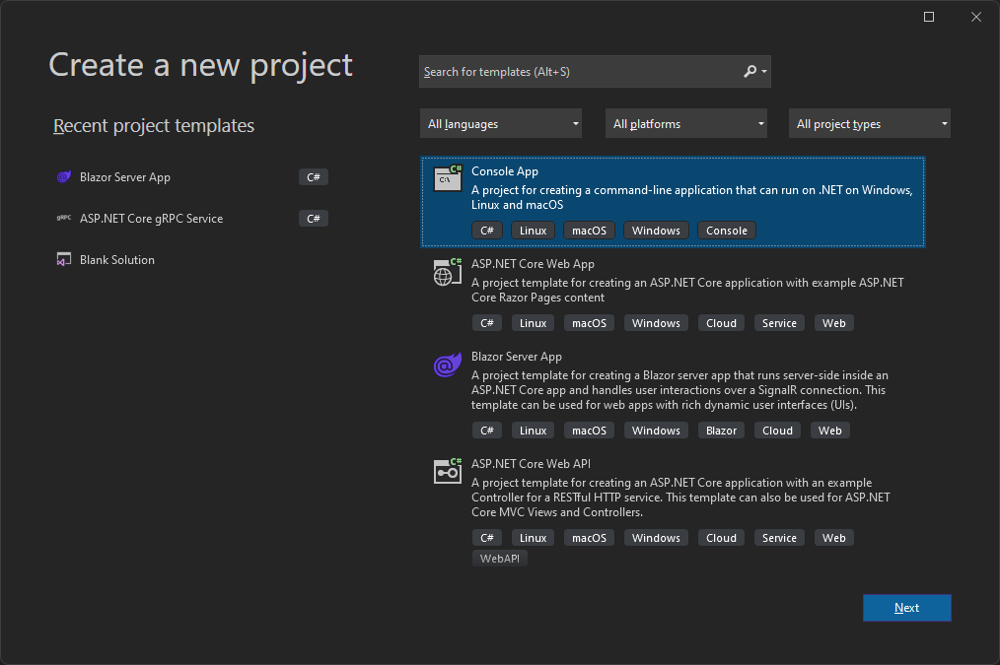
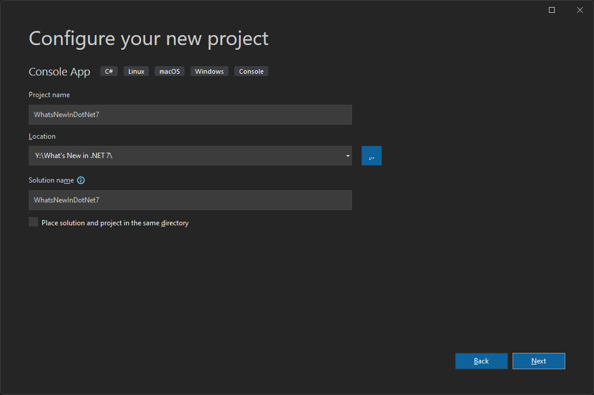
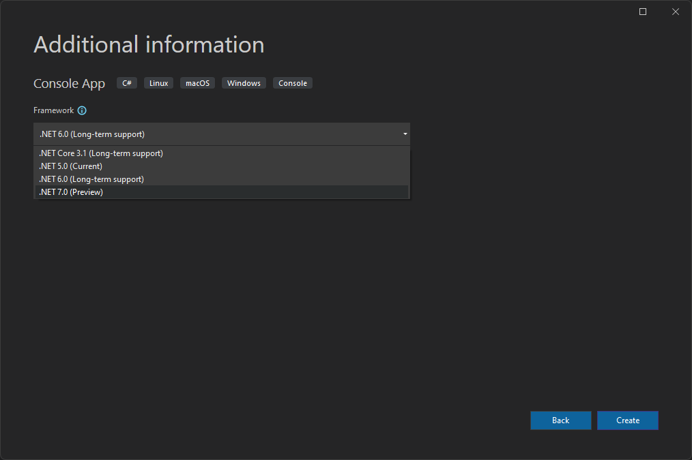
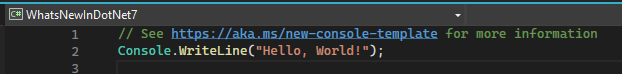
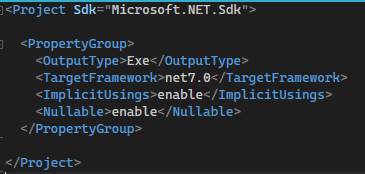
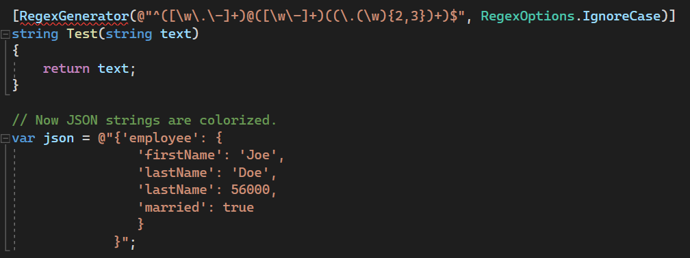
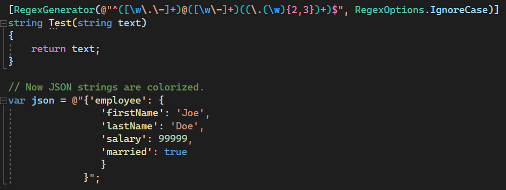

# What's New in .NET 7

.NET 7 builds on the foundation established by .NET 6, which includes a unified set of base libraries, runtime, and SDK, a simplified development experience, and higher developer productivity. Major areas of focus for .NET 7 include improved support for cloud native scenarios, tools to make it easier to upgrade legacy projects, and simplifying the developer experience by making it easier to work with containers.

* Resource: <https://devblogs.microsoft.com/dotnet/announcing-net-7-preview-1/>

## Download .NET 7

Download and install latest version of .NET 7.

|Latest Version|Download|
|--------------|--------|
|7.0.100-preview.3|<https://dotnet.microsoft.com/en-us/download/dotnet/7.0>|

## Create a Console Application in Visual Studio 2022 Preview

Create a new project

  

Configure your new project

  

Select .NET 7.0 (Preview) and click Create

  

Program.cs looks the same as .NET 6.0

  

But the .csproj hast a new TargetFramework

  

## Available TargetFrameworks

```xml
<Project Sdk="Microsoft.NET.Sdk">
  <PropertyGroup>
    <OutputType>Exe</OutputType>
    <!--Available TargetFramework values
    net7.0
    net7.0-android
    net7.0-ios
    net7.0-maccatalyst
    net7.0-macos
    net7.0-tvos
    net7.0-windows-->
    <TargetFramework>net7.0</TargetFramework>
    <ImplicitUsings>enable</ImplicitUsings>
    <Nullable>enable</Nullable>
  </PropertyGroup>
</Project>
```

## StringSyntaxAttribute

This new attribute allows you to specify what kind of data a string represents, for example Regex, JSON, or a DateTime. This will be use to expand syntax highlighting and colorization.

Before

  

After

  

* Resource <https://github.com/dotnet/runtime/issues/62505>

## 


## Complete Code

* [<https://github.com/payini/WhatsNewInDotNet7>](https://github.com/payini/What-s-New-in-.NET-7)

## Resources

|Resource                       |Url                                                     |
|-------------------------------|--------------------------------------------------------|
|.NET 7 Downloads               |<https://dotnet.microsoft.com/en-us/download/dotnet/7.0>|
|ASP.NET Core Roadmap for .NET 7|<https://github.com/dotnet/aspnetcore/issues/39504>     |
|Announcing .NET 7 Preview 1|<https://devblogs.microsoft.com/dotnet/announcing-net-7-preview-1/>|
|Announcing .NET 7 Preview 2 – The New, ‘New’ Experience|<https://devblogs.microsoft.com/dotnet/announcing-dotnet-7-preview-2/>|
|Announcing .NET 7 Preview 2|<https://devblogs.microsoft.com/dotnet/announcing-dotnet-7-preview-3/>|
|StringSyntaxAttribute|<https://github.com/dotnet/runtime/issues/62505>|
|||
|||
|||